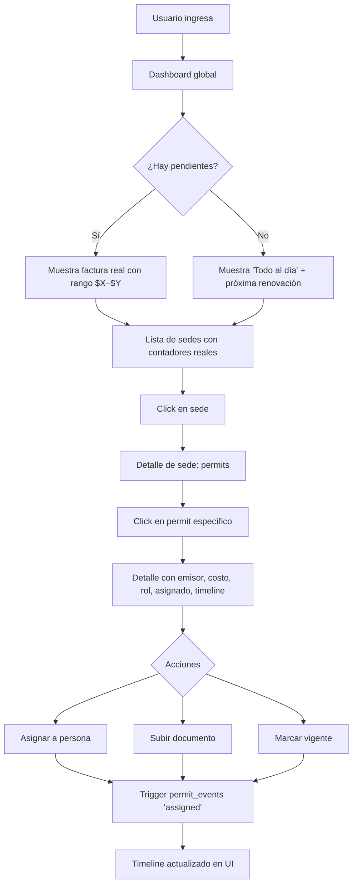

# EnRegla v2 — Rediseño del dominio (especificación)

**Fecha:** 2026-05-10
**Branch propuesta:** `feat/dominio-v2`
**Estado:** Aprobado para planear — pendiente spec sign-off.
**Fuente:** Brainstorming en `docs/superpowers/visuals/2026-05-10-dominio-enregla-v2/` (6 HTMLs con mockups).

---

## 1. Objetivo

Transformar EnRegla de un tracker visual de permisos con data mock a un **producto de compliance operativo** que responde cuatro preguntas claras para cualquier dueño de PyME en Quito:

1. **¿Qué permisos debo tener?** — filtrado automáticamente por giro de mi negocio.
2. **¿Cuánto me cuesta ponerme al día?** — sumado en rango ($380 – $620), no en mock.
3. **¿Quién en mi equipo es responsable?** — rol requerido y asignado, no "el que se acuerde".
4. **¿Qué pasa si no lo hago?** — multa real, documentada, no ficticia.

El rediseño visual del dashboard **NO está en el alcance**. El diseño actual se queda. El trabajo es plomería de datos + schema.

---

## 2. Alcance (qué sí / qué no)

### ✅ Sí entra al MVP
- Ampliar `business_type` de 4 a 10 giros.
- Ampliar permisos de 6 a 8 (sacar IESS).
- Catálogo cerrado de **5 emisores** (SRI, GAD Quito, Bomberos Quito, ARCSA, MSP) — tabla nueva `permit_issuers`.
- Costos: rango `cost_min`/`cost_max` en USD, por permiso, para Quito únicamente.
- Multas reales: `fine_min`/`fine_max` por permiso con referencia a fuente legal.
- Rol requerido: enum simple (`anyone`, `representante_legal`, `contador`, `tecnico_responsable`).
- `permits.assigned_to_profile_id` con warning (no bloqueo) si el rol del asignado no matchea.
- `profiles.business_role` para saber quién es RL/Contador/Técnico en el equipo.
- Trazabilidad: tabla `permit_events` (actor, timestamp, tipo de acción).
- Marco Legal migrado de TS a DB + filtrado por business_type (toggle "ver todos").
- Matriz 10×8 visualizada dentro del Marco Legal como tabla pública.
- Fix del bug "sin trámites pendientes" en dashboard (contar también `no_registrado` y `en_tramite`).
- Factura real = suma de `cost_min`/`cost_max` de pendientes, formato rango.
- `brandName` del dashboard = `companies.name`.
- Bucket de dropdowns de UI con fondo opaco (ya aplicado en branch audit).

### ⏸️ Sprint siguiente (post-MVP, fuera de scope)
- `business_type` por sede (hoy va por empresa).
- Business role multi-rol + delegation rules.
- Editor staff-only de marco legal en `/internal/legal`.
- Expansión a Guayaquil y otras ciudades (requiere emisores municipales adicionales).
- IESS como producto paralelo RRHH.
- Permisos condicionales avanzados ("si tenés generador eléctrico").
- Gráfica de cumplimiento en el tiempo.
- Frecuencia/periodicidad estructurada (`renewal_frequency`).

### ❌ Fuera de producto (no se construye)
- Taxonomía jerárquica (categoría → subcategoría).
- Fórmulas dinámicas de precio por municipio.
- Workflow de aprobación interno (mejor para corporativos, no PyME).
- Chat / comentarios in-app.
- Ruta `/design-system` en producción (ya hay follow-up).

---

## 3. Modelo de datos

### 3.1. Nueva tabla `permit_issuers`

```sql
CREATE TABLE public.permit_issuers (
  id                     uuid PRIMARY KEY DEFAULT gen_random_uuid(),
  slug                   text UNIQUE NOT NULL,
  name                   text NOT NULL,
  short_name             text NOT NULL,
  scope                  text NOT NULL CHECK (scope IN ('nacional','municipal')),
  city                   text,                      -- NULL si nacional
  portal_url             text,                      -- home institucional
  procedures_portal_url  text,                      -- portal de trámites
  contact_url            text,                      -- formulario web (no email)
  phone                  text,
  address                text,                      -- dirección en Quito
  notes                  text,                      -- ej: "Sede principal en Guayaquil" para ARCSA
  logo_url               text,
  created_at             timestamptz DEFAULT now(),
  updated_at             timestamptz DEFAULT now()
);

-- RLS: SELECT público (anon + authenticated) porque es catálogo de consulta.
-- INSERT/UPDATE/DELETE solo service_role (staff) + trigger updated_at.
```

**Seed inicial (5 filas, datos reales del scraping):**

| slug | name | short_name | scope | city | portal_url | phone | address |
|---|---|---|---|---|---|---|---|
| sri | Servicio de Rentas Internas | SRI | nacional | NULL | https://www.sri.gob.ec | 02 393 6300 | Plataforma Gubernamental Financiera, Av. Amazonas entre Unión Nacional de Periodistas y José Villalengua |
| gad_quito | Gobierno Autónomo Descentralizado del DM de Quito | GAD Quito | municipal | Quito | https://www.quito.gob.ec | (593-2) 3952300 / 1800 510 510 | Venezuela entre Espejo y Chile, Quito 170101 |
| bomberos_quito | Cuerpo de Bomberos del Distrito Metropolitano de Quito | Bomberos Quito | municipal | Quito | https://bomberosquito.gob.ec | 102 (emergencia) | n/p |
| arcsa | Agencia Nacional de Regulación, Control y Vigilancia Sanitaria | ARCSA | nacional | NULL | https://www.controlsanitario.gob.ec | +593 4 3727 440 | Sede principal Guayaquil; oficina en Quito |
| msp | Ministerio de Salud Pública | MSP | nacional | NULL | https://www.salud.gob.ec | 593-2 381-4400 | Av. Quitumbe Ñan y Av. Amaru Ñan, Plataforma Gubernamental Desarrollo Social, CP 170702 |

### 3.2. Extensiones a `companies`

```sql
ALTER TABLE public.companies
  DROP CONSTRAINT companies_business_type_check;

ALTER TABLE public.companies
  ADD CONSTRAINT companies_business_type_check CHECK (business_type IN (
    'restaurante','retail','food_truck','consultorio',
    'cafeteria','panaderia','bar','farmacia',
    'gimnasio','salon_belleza','oficina','otro'
  ));
```

### 3.3. Extensiones a `permit_requirements`

```sql
ALTER TABLE public.permit_requirements
  ADD COLUMN issuer_id        uuid REFERENCES public.permit_issuers(id) ON DELETE SET NULL,
  ADD COLUMN required_role    text NOT NULL DEFAULT 'anyone'
    CHECK (required_role IN ('anyone','representante_legal','contador','tecnico_responsable')),
  ADD COLUMN cost_min         numeric(10,2),
  ADD COLUMN cost_max         numeric(10,2),
  ADD COLUMN cost_currency    text DEFAULT 'USD',
  ADD COLUMN cost_notes       text,
  ADD COLUMN cost_updated_at  date,
  ADD COLUMN fine_min         numeric(10,2),
  ADD COLUMN fine_max         numeric(10,2),
  ADD COLUMN fine_source      text,         -- URL o cita legal
  ADD COLUMN applies_when     text;         -- descripción de trigger condicional
```

### 3.4. Extensiones a `permits`

```sql
ALTER TABLE public.permits
  ADD COLUMN issuer_id               uuid REFERENCES public.permit_issuers(id) ON DELETE SET NULL,
  ADD COLUMN assigned_to_profile_id  uuid REFERENCES public.profiles(id) ON DELETE SET NULL;

-- permits.issuer (string libre) queda deprecado. Se mantiene durante la migración
-- de datos y se elimina en una migración posterior tras 1 release estable.
COMMENT ON COLUMN public.permits.issuer IS 'DEPRECATED: reemplazado por issuer_id. Drop en siguiente release.';
```

### 3.5. Extensiones a `profiles`

```sql
ALTER TABLE public.profiles
  ADD COLUMN business_role text NOT NULL DEFAULT 'empleado'
    CHECK (business_role IN ('empleado','representante_legal','contador','tecnico_responsable'));

-- Default: el usuario que crea la company en onboarding queda como RL.
-- El trigger auto_assign_company_to_profile (existente) se extiende para setear business_role = 'representante_legal'.
```

### 3.6. Nueva tabla `permit_events` (trazabilidad)

```sql
CREATE TABLE public.permit_events (
  id           uuid PRIMARY KEY DEFAULT gen_random_uuid(),
  permit_id    uuid NOT NULL REFERENCES public.permits(id) ON DELETE CASCADE,
  actor_id     uuid REFERENCES public.profiles(id) ON DELETE SET NULL,
  event_type   text NOT NULL CHECK (event_type IN (
    'created',
    'status_changed',
    'document_uploaded',
    'document_deleted',
    'assigned',
    'unassigned',
    'renewed',
    'dates_updated'
  )),
  from_value   text,   -- ej: status anterior
  to_value     text,   -- ej: status nuevo
  metadata     jsonb,  -- opcional: campos adicionales del evento
  created_at   timestamptz DEFAULT now()
);

-- Índice para listar eventos por permit en orden cronológico
CREATE INDEX idx_permit_events_permit_created
  ON public.permit_events (permit_id, created_at DESC);

-- RLS: mismo company scoping que permits.
-- Se crea vía triggers AFTER UPDATE/INSERT en permits y documents.
```

### 3.7. Cambios a tablas legales

Las tablas `legal_references`, `legal_sources`, `legal_consequences`, `legal_required_documents`, `legal_process_steps` ya existen pero están vacías (la data vive en `src/data/legal-references.ts`).

**Migración:** poblarlas desde el TS y eliminar el archivo de código. La columna `legal_references.business_categories text[]` ya existe y se usa para el filtrado.

---

## 4. Matriz de permisos × giros (seed maestro)

8 permisos × 10 giros = **~80 filas** en `permit_requirements`. Valores de la columna:
- `R` — requerido (`is_mandatory = true`, `applies_when = NULL`)
- `O` — opcional (`is_mandatory = false`)
- `T` — condicional (`applies_when` describe la condición, ej: "si tiene letrero exterior")
- `—` — no aplica (no se crea fila)

| Permiso | Emisor | Resto | Retail | Food truck | Consultorio | Cafetería | Panadería | Bar | Farmacia | Gimnasio | Salón | Oficina |
|---|---|:-:|:-:|:-:|:-:|:-:|:-:|:-:|:-:|:-:|:-:|:-:|
| RUC | SRI | R | R | R | R | R | R | R | R | R | R | R |
| Patente municipal | GAD Quito | R | R | R | R | R | R | R | R | R | R | R |
| Uso de suelo | GAD Quito | R | R | — | R | R | R | R | R | R | R | R |
| LUAE | GAD Quito | R | R | O | R | R | R | R | R | R | R | R |
| Bomberos | Bomberos Quito | R | R | R | R | R | R | R | R | R | R | R |
| ARCSA | ARCSA | R | — | R | O | R | R | R | R | — | O | — |
| Rotulación | GAD Quito | T | T | — | T | T | T | T | T | T | T | T |
| Permiso MSP | MSP | — | — | — | R | — | — | — | R | O | O | — |

Rol requerido por permiso (misma fila se aplica a todas las columnas):

| Permiso | Rol requerido |
|---|---|
| RUC | representante_legal |
| Patente municipal | anyone |
| Uso de suelo | representante_legal |
| LUAE | representante_legal |
| Bomberos | anyone |
| ARCSA | tecnico_responsable |
| Rotulación | anyone |
| Permiso MSP | tecnico_responsable |

Costos y multas reales son responsabilidad del que escriba el seed (se investiga por permiso en Quito 2026).

---

## 5. Migraciones y seed

### Orden de migraciones (una por paso atómico para auditabilidad):

1. **`2026-05-11_issuers_schema.sql`** — crea `permit_issuers` + RLS + seed de 5 emisores.
2. **`2026-05-11_business_types_expand.sql`** — amplía CHECK de `companies.business_type` a 12 valores.
3. **`2026-05-11_permit_requirements_fields.sql`** — añade columnas de costo, multa, rol, issuer_id a `permit_requirements`.
4. **`2026-05-11_permits_domain.sql`** — añade `issuer_id`, `assigned_to_profile_id` a `permits`.
5. **`2026-05-11_profiles_business_role.sql`** — añade `business_role` a `profiles`. Extiende trigger `auto_assign_company_to_profile` para setearlo.
6. **`2026-05-11_permit_events.sql`** — crea tabla + índice + RLS + triggers AFTER UPDATE/INSERT en permits y documents.
7. **`2026-05-11_legal_tables_seed.sql`** — puebla tablas legales desde TS. Seed con filtros por `business_categories`.
8. **`2026-05-11_permit_requirements_seed.sql`** — puebla la matriz 10×8 con costos y multas reales. Refresca seed existente de 20 filas → nuevas ~80 filas.
9. **`2026-05-11_cleanup_deprecated.sql`** — hasta aquí `permits.issuer` string sigue vivo. Se elimina en release posterior, una vez migrados todos los datos existentes.

### Data migration path para permits existentes
Hay 46 permits en prod (tabla real). Migración de datos:
- Mapear `permits.issuer` (texto libre) a `issuer_id` por tabla de equivalencias: `"SRI" → sri`, `"Municipio" → gad_quito`, `"ARCSA" → arcsa`, `"SCPM" → NULL` (no aplica MVP), `"CONSEP" → NULL` (obsoleto desde 2015).
- `assigned_to_profile_id` queda NULL para permits pre-existentes. Se muestran como "sin asignar" en UI.

---

## 6. Cambios de código (frontend)

### 6.1. Dashboard (`src/features/dashboard/DashboardView.tsx`)
**Sin cambios de diseño.** Cambios internos:

- Línea 15: eliminar `AVG_PERMIT_COST = 45`.
- Línea 72-100: re-escribir `metrics`:
  ```ts
  const pending = activePermits.filter(p =>
    ['no_registrado','vencido','por_vencer','en_tramite'].includes(p.status)
  );
  const costMin = pending.reduce((acc, p) => acc + (p.cost_min ?? 0), 0);
  const costMax = pending.reduce((acc, p) => acc + (p.cost_max ?? 0), 0);
  const fineMin = pending.reduce((acc, p) => acc + (p.fine_min ?? 0), 0);
  const fineMax = pending.reduce((acc, p) => acc + (p.fine_max ?? 0), 0);
  ```
- Línea 134-136: `brandName = company?.name ?? 'tu negocio'` (fetch en el mismo hook o en `useCompany`).
- Línea 140-149: `invoiceLines` se construye agrupando por `issuer.short_name`, con `amount` = rango `$${min} – $${max}` (tipo `InvoiceLine.amount` se amplía a `{min, max} | number`).
- Línea 149: **fix bug**: "Sin trámites pendientes" se muestra solo cuando `pending.length === 0`, usando la variable corregida.

### 6.2. Permit detail (`src/features/permits/PermitDetailView.tsx`)
Agregar sección "Información del trámite":
- Emisor: chip con logo + nombre, clickeable al `portal_url`.
- Costo estimado: rango `$X – $Y` + `cost_notes` si hay.
- Multa si no se regulariza: rango `$X – $Y` + link a `fine_source`.
- Rol requerido: badge con icono según rol.
- Asignado a: dropdown con empleados de la empresa, filtrado por rol requerido. Warning (no bloqueo) si el asignado no matchea.

### 6.3. Marco Legal (`src/features/legal/`)
- Nuevo hook `useLegalReferences()` que lee de DB (no del TS).
- Filtrado por `profile.company.business_type` por defecto.
- Toggle superior: `☑ Solo para mi giro` / `☐ Ver todos los permisos` (default: checked).
- **Nueva vista**: matriz 10×8 como tabla en `/marco-legal/matriz`, similar al HTML de la pregunta 1 del brainstorming (data pública, leída de `permit_requirements` con JOIN a `permit_issuers`).

### 6.4. Ajustes UI
- Crear dropdown de **asignación de permit a persona** con filtro por rol.
- Crear badge de rol requerido (4 variantes: ALL/RL/CT/TR).
- Timeline de `permit_events` en el detalle del permit.
- **Borrar** `src/data/legal-references.ts` al final (sustituido por DB).

---

## 7. Flujo de usuario



---

## 8. Estado de decisiones

| # | Decisión | Estado |
|---|---|---|
| 1 | 10 giros de negocio | Aprobado |
| 2 | 8 permisos MVP (sin IESS) | Aprobado |
| 3 | Matriz 10×8 | Aprobado (pulido posterior admitido) |
| 4 | Modelo de costos B (rango + notas) | Aprobado |
| 5 | Solo USD, solo Quito, precios visibles en marco legal | Aprobado |
| 6 | Catálogo cerrado de 5 emisores, staff-only | Aprobado |
| 7 | Schema de `permit_issuers` con teléfono + dirección + URLs | Aprobado |
| 8 | 4 roles: empleado / RL / contador / técnico responsable | Aprobado |
| 9 | Opción 1 simple (un rol por permiso) | Aprobado; multi-rol queda como follow-up |
| 10 | Warning no bloqueo en asignación | Aprobado |
| 11 | No tocar diseño del dashboard | Aprobado |
| 12 | Fix bug "sin trámites pendientes" | Aprobado |
| 13 | Multas reales por permiso | Aprobado (investigación pendiente del seed) |
| 14 | Matriz visible en Marco Legal | Aprobado |

---

## 9. Riesgos y mitigación

| Riesgo | Probabilidad | Impacto | Mitigación |
|---|---|---|---|
| El seed de matriz × costos × multas toma más de lo estimado | Media | Medio | Primera versión con costos "conocidos" (los que vos tengas claros) y `NULL` donde no hay; las filas sin costo aparecen como "sin estimar" en UI, no bloquean. Se completan en segunda pasada. |
| Cambios de schema rompen permits existentes del demo | Baja | Alto | Migraciones son atómicas + rollback-friendly. `permits.issuer` string queda vivo durante la migración. |
| Filtro de marco legal por giro esconde permisos que el usuario sí necesita | Media | Medio | Toggle "Ver todos" por default visible, estado persistido en localStorage. |
| Usuarios con permits pre-existentes ven "sin asignar" todo | Alta | Bajo | Es correcto — el owner reasigna cuando quiera. Un banner explicativo en la primera carga lo clarifica. |
| La matriz pública del marco legal expone datos sensibles | Baja | Bajo | Solo se expone data de catálogo (precios + emisores + permisos), no hay datos de empresas. Vive como tabla anon-readable. |

---

## 10. Entregables

1. **9 migraciones SQL** (sección 5).
2. **Seed de 5 emisores** (datos reales ya recopilados).
3. **Seed de matriz 10×8** (costos + multas por investigar).
4. **Cambios de código frontend** (sección 6): dashboard fix + permit detail + marco legal + nuevos componentes.
5. **Plan de implementación** en `docs/superpowers/plans/2026-05-11-dominio-v2-implementation.md` (siguiente paso del workflow).

---

## 11. Fuera de spec pero relacionado

- El arreglo de dropdowns transparentes ya fue aplicado en la branch de auditoría (`audit/pre-production-2026-05-10`) y debe ser mergeado antes de que este trabajo empiece.
- El fix del trigger `user_company_id() EXECUTE` también está en la branch de auditoría.
